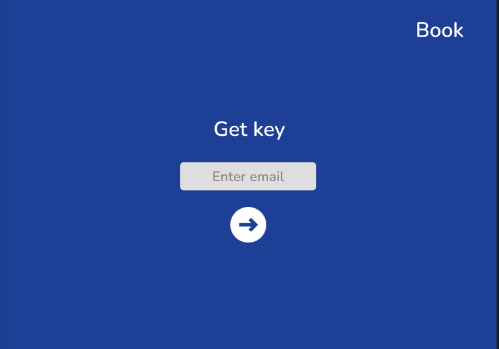
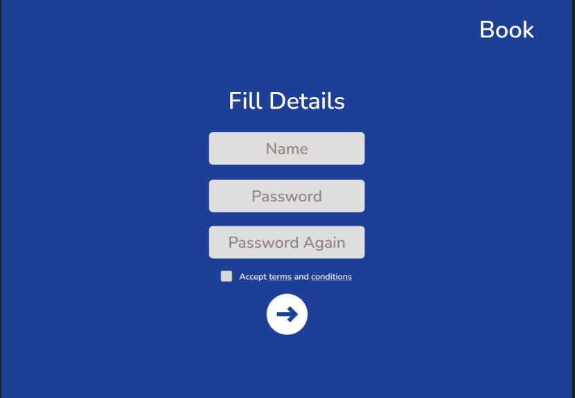
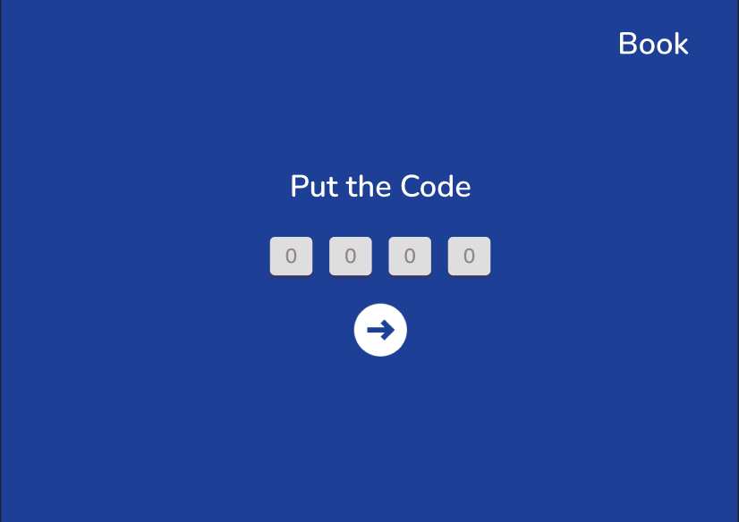
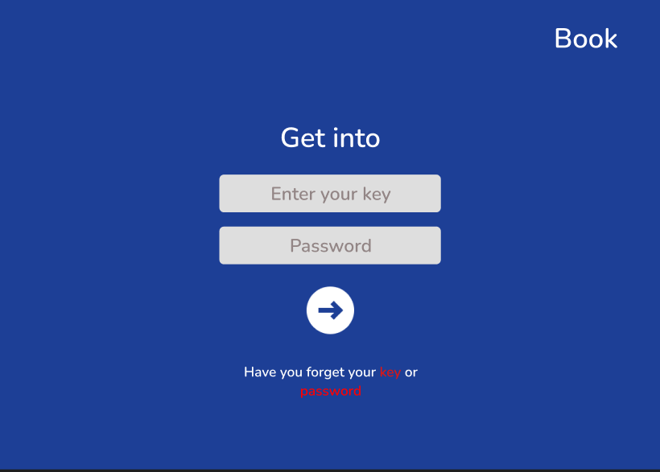
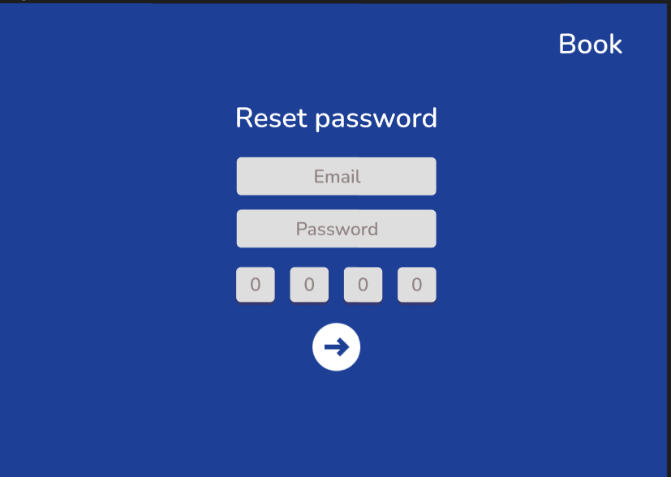
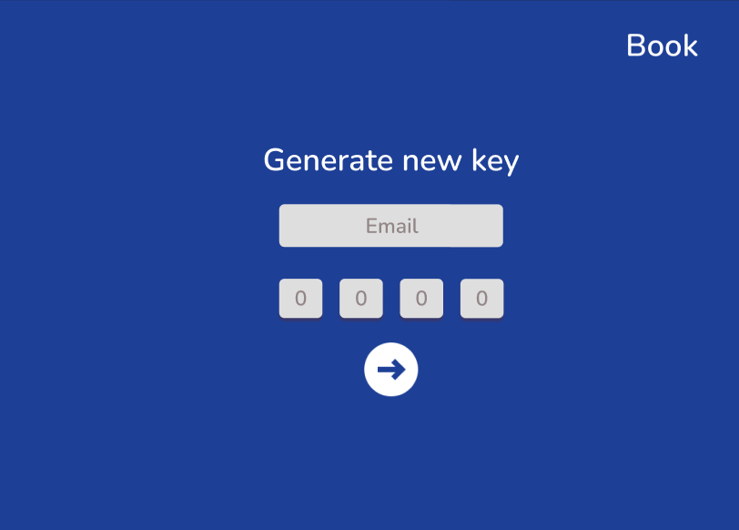
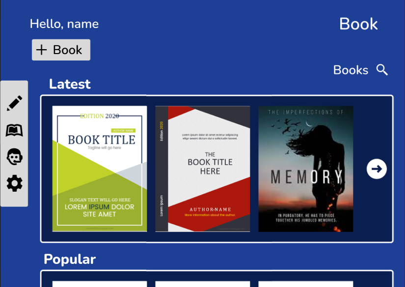

# Book

The book is a blog website in this user can create it's blog in kind of a book and can share it's thoughts and knowledge to the world throw this app.

## Technologies are used

This application created by using latest advance technologies and libraries   are given below----

| Tech & Library | Description |
| ------ | ------ |
| React | javascript frontend library |
| Node Js | javascript runtime for backend
 |
| Express | a node js library for backend |
| MongoDb | database |
| Tailwind | a css library for designing |
| React Redux Toolkit | a javascript library to manage application states |

### Description

This is a web application for creating and reading blogs in a better manner.

### `Design`

1. ## Guest Page

2. ## Signup 

*Registration process will be done by using otp verification.*

3. ## Otp

4. ## Login

5. ## Reset Password

6. ## New Key

7. ## Home

